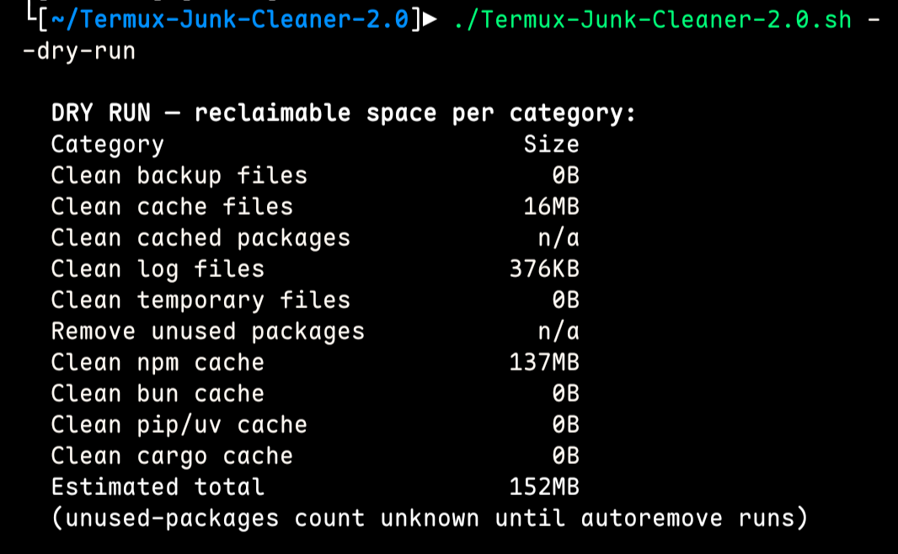
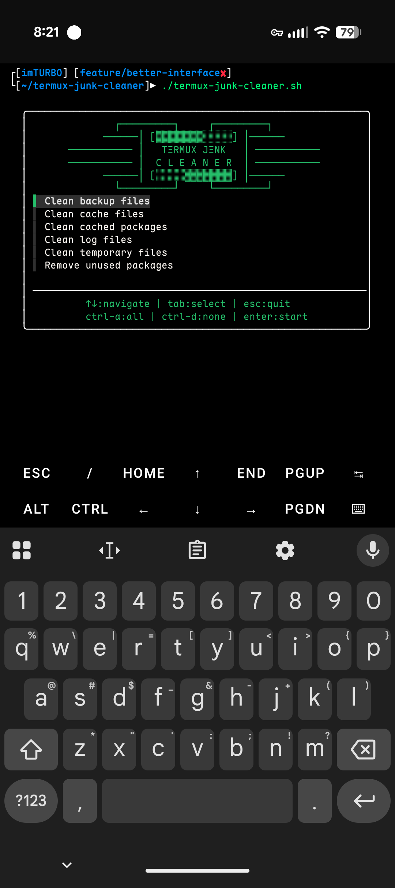
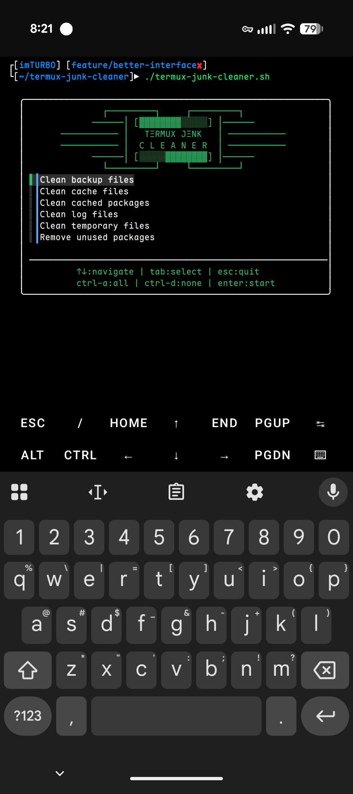
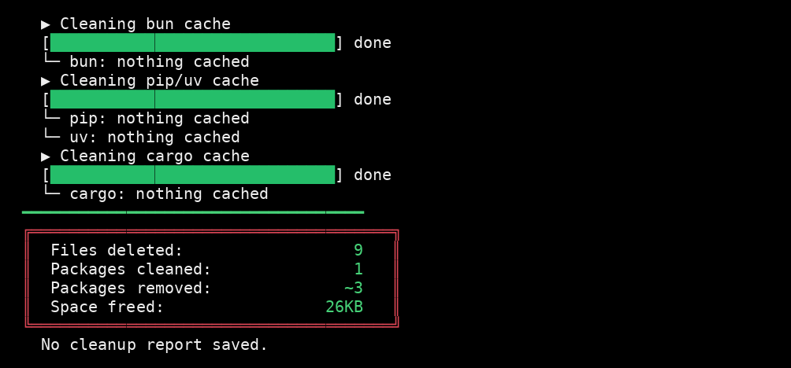

<p align="center">

$$
\begin{matrix}
\color{#D2691E}{\text{         ┌─────────┐ ឵឵  ឵឵  ឵឵}}\kern{125pt}\color{#D2691E}{\text{ ឵឵ ឵឵  ឵឵ ┌─────────┐}}\text{} \\
\color{#D2691E}{\text{       ──────│}}\kern{14pt}\color{#ADD8E6}{\text{[▓▓▓▓▓▓▓▓░░░░░]}}\kern{14pt}\color{#D2691E}{\text{│──────}} \\
\color{#D2691E}{\text{ ─────────── │}}\quad\kern{16pt}\color{#5af78e}{\text{𝗧Ξ𝗥𝗠𝗨𝗫}}\kern{10pt}\color{#5af78e}{\text{𝗝Ξ𝗡𝗞}}\kern{16pt}\quad\color{#D2691E}{\text{│ ───────────}} \\
\color{#D2691E}{\text{ ─────────── │}}\kern{14pt}\color{#5af78e}{\text{𝗖}}\kern{10pt}\color{#5af78e}{\text{𝗟}}\kern{10pt}\color{#5af78e}{\text{𝗘}}\kern{10pt}\color{#5af78e}{\text{𝗔}}\kern{10pt}\color{#5af78e}{\text{𝗡}}\kern{10pt}\color{#5af78e}{\text{𝗘}}\kern{10pt}\color{#5af78e}{\text{𝗥}}\kern{14pt}\color{#D2691E}{\text{│ ───────────}} \\
\color{#D2691E}{\text{       ──────│}}\kern{14pt}\color{#ADD8E6}{\text{[░░░░░▓▓▓▓▓▓▓▓]}}\kern{14pt}\color{#D2691E}{\text{│──────}} \\
\color{#D2691E}{\text{         └─────────┘ ឵឵  ឵឵  ឵឵}}\kern{125pt}\color{#D2691E}{\text{ ឵឵  ឵឵  ឵឵└─────────┘}}\text{}
\end{matrix}
$$

</p>
<p align="center">
<a href="https://github.com/DEAD1nsane"></a>
</p>
<p align="center">
<a href="https://github.com/DEAD1nsane/Termux-Junk-Cleaner-2.0"></a>
<a href="https://github.com/DEAD1nsane/Termux-Junk-Cleaner-2.0"></a>
<a href="https://github.com/DEAD1nsane/Termux-Junk-Cleaner-2.0"></a>
<a href="https://github.com/ArjunCodesmith"></a>
</p>

## About

Termux Junk Cleaner is a powerful junk cleanup tool designed to optimize and declutter your Termux environment. It offers a clean, interactive interface to remove unnecessary files, logs, cached data, and more.

## Install

Run this one-liner to clone, install dependencies, and make executable:

```bash
# Clone the repository
git clone https://github.com/DEAD1nsane/Termux-Junk-Cleaner-2.0.git

# Navigate to directory
cd Termux-Junk-Cleaner-2.0

# Install fzf (required for interactive menu)
pkg install fzf -y

# Make script executable
chmod +x tjc.sh
```

Then run:
```bash
./tjc.sh
```

Non-interactive options: `--all` (clean everything), `--dry-run` (show reclaimable sizes, delete nothing), `--yes` (skip confirmation), `--help`.

<p align="center">
  <a href="screenshots/dry-run.png">
    
  </a>
</p>

## Features

- **Interactive Menu** - fzf-powered checkbox interface with arrow key navigation
- **Selective Cleanup** - Choose exactly what to clean
- **Visual Feedback** - Animated loading bars for each operation
- **Cleanup Summary** - View stats after each run

### What it cleans:
| Option | Description |
|--------|-------------|
| Backup files | Removes `*.bak` files |
| Cache files | Clears `~/.cache` and app cache |
| Cached packages | Runs `apt-get clean` |
| Log files | Removes `*.log` files |
| Temporary files | Clears `~/tmp` |
| Unused packages | Runs `apt autoremove` |

## Controls

| Key | Action |
|-----|--------|
| `↑↓` | Navigate |
| `Tab` | Select/Deselect |
| `Ctrl+A` | Select all |
| `Ctrl+D` | Deselect all |
| `Enter` | Start cleanup |
| `Esc` | Quit |

## Screenshots

<p align="center">
  <a href="screenshots/unselected.png">
    
  </a>
  <a href="screenshots/selected.png">
    
  </a>
  <a href="screenshots/finished.png">
    
  </a>
</p>

## Credits

**ArjunCodesmith** - Original author and creator, logo design

**DEAD1nsane** - Interactive menu UI and loading animations
